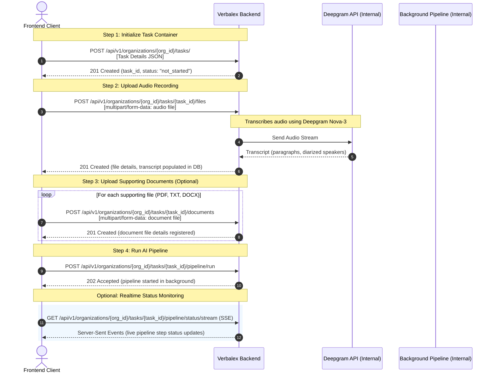

# Verbalex Frontend Integration Guide: Task Creation & Processing Flow

This guide provides a comprehensive walkthrough for frontend developers connecting the client-side task creation UI to the **Verbalex Backend**. 

To successfully create a task and process it, the frontend must coordinate four distinct API endpoints in a specific sequence.

---

## 🔄 Task Creation & Processing Lifecycle

The diagram below illustrates the exact order in which APIs must be called.



---

## 🔑 Base Specifications & Authentication

* **Base URL**: `https://<api-domain>/api/v1` (locally: `http://localhost:8000/api/v1`)
* **Headers**: Every request requires the JWT authorization token and the scoped organization ID:
  ```http
  Authorization: Bearer <JWT_ACCESS_TOKEN>
  ```
* **Variables**:
  * `{org_id}`: The UUID of the current active organization.
  * `{task_id}`: The UUID of the task generated in Step 1.

---

## 1. Create Task Container

Before uploading any files, you must establish a metadata container for the task.

- **Method**: `POST`
- **Path**: `/organizations/{org_id}/tasks/`
- **Content-Type**: `application/json`

### 📥 Request Body
```json
{
  "name": "Q3 Financial Performance Sync",
  "description": "Transcription and analysis of the quarterly budget review meeting.",
  "tags": ["Finance", "Q3", "Meeting"]
}
```

| Field | Type | Required | Constraints | Description |
| :--- | :--- | :--- | :--- | :--- |
| `name` | `string` | **Yes** | 1 - 255 chars | The display name for the task. |
| `description` | `string` | No | - | Detailed description/notes for the task. |
| `tags` | `string[]` | No | Defaults to `[]` | Category tags for organizing/filtering. |

### 📤 Response Body (201 Created)
```json
{
  "id": "e8a93cb3-c15d-4f7f-8d9e-561b369c0d38",
  "organization_id": "8ba12345-6789-abcd-ef01-23456789abcd",
  "created_by": "11a67890-bcde-f012-3456-7890abcdef12",
  "name": "Q3 Financial Performance Sync",
  "description": "Transcription and analysis of the quarterly budget review meeting.",
  "status": "not_started",
  "tags": [
    "Finance",
    "Q3",
    "Meeting"
  ],
  "created_at": "2026-05-24T19:15:00.123456Z",
  "updated_at": "2026-05-24T19:15:00.123456Z"
}
```

---

## 2. Upload Audio File (Transcription)

Upload the core audio file for the task. 

> [!NOTE]
> When this endpoint is called, the backend automatically runs **Deepgram Nova-3** with speaker diarization on the file, generates speaker-separated chunks, and pre-saves the transcript to the database before returning a response. This call may take a few seconds depending on audio size.

- **Method**: `POST`
- **Path**: `/organizations/{org_id}/tasks/{task_id}/files`
- **Content-Type**: `multipart/form-data`

### 📥 Request Body (Form-Data)
| Key | Type | Required | Description |
| :--- | :--- | :--- | :--- |
| `file` | `File` (Binary) | **Yes** | The audio file (supported: `.mp3`, `.wav`, `.m4a`, `.ogg`, `.flac`). |

### 📤 Response Body (201 Created)
```json
{
  "id": "77bc1b29-e854-47bb-a94f-a9ef0fa3b821",
  "task_id": "e8a93cb3-c15d-4f7f-8d9e-561b369c0d38",
  "file_name": "q3_meeting_audio.mp3",
  "file_path": "audio/77bc1b29-e854-47bb-a94f-a9ef0fa3b821.mp3",
  "file_type": "audio",
  "file_size": 24519302,
  "mime_type": "audio/mpeg",
  "uploaded_at": "2026-05-24T19:15:20.654321Z"
}
```

---

## 3. Upload Supporting Document

Upload non-audio reference files (e.g., guidelines, meeting slides, reference sheets) that the AI should use when compiling the final report.

- **Method**: `POST`
- **Path**: `/organizations/{org_id}/tasks/{task_id}/documents`
- **Content-Type**: `multipart/form-data`

### 📥 Request Body (Form-Data)
| Key | Type | Required | Description |
| :--- | :--- | :--- | :--- |
| `file` | `File` (Binary) | **Yes** | The document file (supported: `.pdf`, `.txt`, `.docx`, `.csv`, `.xlsx`). |

### 📤 Response Body (201 Created)
```json
{
  "id": "f5d72f9a-1122-3344-5566-778899aabbcc",
  "task_id": "e8a93cb3-c15d-4f7f-8d9e-561b369c0d38",
  "file_name": "q3_budget_sheet.pdf",
  "file_path": "raw_data/f5d72f9a-1122-3344-5566-778899aabbcc.pdf",
  "file_type": "raw_data",
  "file_size": 1048576,
  "mime_type": "application/pdf",
  "uploaded_at": "2026-05-24T19:15:35.987654Z"
}
```

---

## 4. Trigger AI Processing Pipeline

Once all files are uploaded, initiate the 7-step background analysis pipeline.

- **Method**: `POST`
- **Path**: `/organizations/{org_id}/tasks/{task_id}/pipeline/run`
- **Content-Type**: `application/json` (Empty body)

### 📥 Request Body
*None (Empty request body)*

### 📤 Response Body (202 Accepted)
```json
{
  "message": "Pipeline started successfully",
  "pipeline_run_id": "d04a6011-8c44-4899-b1d5-bc44d673841a"
}
```

---

## 💡 Frontend Integration Example (TypeScript)

Here is a clean, robust, copy-pasteable TypeScript module showing how to fully chain these requests, including progress tracking and handling multiple file uploads.

```typescript
interface TaskCreateData {
  name: string;
  description?: string;
  tags?: string[];
}

interface TaskResponse {
  id: string;
  status: string;
  name: string;
}

interface UploadResponse {
  id: string;
  file_name: string;
  file_type: string;
}

interface PipelineStartResponse {
  message: string;
  pipeline_run_id: string;
}

export class VerbalexClient {
  private baseUrl: string;
  private token: string;

  constructor(baseUrl: string, token: string) {
    this.baseUrl = baseUrl;
    this.token = token;
  }

  private getHeaders(isMultipart = false): Record<string, string> {
    const headers: Record<string, string> = {
      'Authorization': `Bearer ${this.token}`,
    };
    if (!isMultipart) {
      headers['Content-Type'] = 'application/json';
    }
    return headers;
  }

  /**
   * Complete flow to create a task, upload audio, upload supporting documents, and trigger the pipeline.
   */
  async createAndProcessTask(
    orgId: string,
    taskDetails: TaskCreateData,
    audioFile: File,
    supportingDocuments: File[] = []
  ): Promise<string> {
    try {
      console.log('Step 1/4: Initializing task container...');
      const task = await this.createTask(orgId, taskDetails);
      console.log(`Task created with ID: ${task.id}`);

      console.log('Step 2/4: Uploading and transcribing audio (Deepgram)...');
      await this.uploadAudio(orgId, task.id, audioFile);
      console.log('Audio processed and transcribed successfully!');

      if (supportingDocuments.length > 0) {
        console.log(`Step 3/4: Uploading ${supportingDocuments.length} supporting documents...`);
        for (const doc of supportingDocuments) {
          await this.uploadDocument(orgId, task.id, doc);
          console.log(`Uploaded document: ${doc.name}`);
        }
      }

      console.log('Step 4/4: Launching background AI pipeline...');
      const pipelineInfo = await this.triggerPipeline(orgId, task.id);
      console.log(`Pipeline initiated successfully. Run ID: ${pipelineInfo.pipeline_run_id}`);

      return task.id;
    } catch (error) {
      console.error('Failed to complete Verbalex task creation flow:', error);
      throw error;
    }
  }

  /**
   * 1. POST /organizations/{org_id}/tasks/
   */
  async createTask(orgId: string, data: TaskCreateData): Promise<TaskResponse> {
    const url = `${this.baseUrl}/organizations/${orgId}/tasks/`;
    const response = await fetch(url, {
      method: 'POST',
      headers: this.getHeaders(),
      body: JSON.stringify(data),
    });

    if (!response.ok) {
      throw new Error(`Failed to create task: ${response.statusText} (${await response.text()})`);
    }
    return response.json();
  }

  /**
   * 2. POST /organizations/{org_id}/tasks/{task_id}/files
   */
  async uploadAudio(orgId: string, taskId: string, file: File): Promise<UploadResponse> {
    const url = `${this.baseUrl}/organizations/${orgId}/tasks/${taskId}/files`;
    const formData = new FormData();
    formData.append('file', file);

    const response = await fetch(url, {
      method: 'POST',
      headers: this.getHeaders(true),
      body: formData,
    });

    if (!response.ok) {
      throw new Error(`Failed to upload audio: ${response.statusText} (${await response.text()})`);
    }
    return response.json();
  }

  /**
   * 3. POST /organizations/{org_id}/tasks/{task_id}/documents
   */
  async uploadDocument(orgId: string, taskId: string, file: File): Promise<UploadResponse> {
    const url = `${this.baseUrl}/organizations/${orgId}/tasks/${taskId}/documents`;
    const formData = new FormData();
    formData.append('file', file);

    const response = await fetch(url, {
      method: 'POST',
      headers: this.getHeaders(true),
      body: formData,
    });

    if (!response.ok) {
      throw new Error(`Failed to upload document: ${response.statusText} (${await response.text()})`);
    }
    return response.json();
  }

  /**
   * 4. POST /organizations/{org_id}/tasks/{task_id}/pipeline/run
   */
  async triggerPipeline(orgId: string, taskId: string): Promise<PipelineStartResponse> {
    const url = `${this.baseUrl}/organizations/${orgId}/tasks/${taskId}/pipeline/run`;
    const response = await fetch(url, {
      method: 'POST',
      headers: this.getHeaders(),
    });

    if (!response.ok) {
      throw new Error(`Failed to trigger pipeline: ${response.statusText} (${await response.text()})`);
    }
    return response.json();
  }

  /**
   * [Optional] Establish Realtime SSE Connection for progress indicator
   */
  listenToPipelineStatus(
    orgId: string,
    taskId: string,
    onStatusUpdate: (data: any) => void,
    onError: (err: any) => void
  ): EventSource {
    const url = `${this.baseUrl}/organizations/${orgId}/tasks/${taskId}/pipeline/status/stream`;
    
    // Pass JWT via URL query parameter or standard EventSource connection
    // NOTE: Native EventSource doesn't support custom headers easily, so SSE middleware
    // might expect token in cookies or query params depending on backend setup.
    const eventSource = new EventSource(`${url}?token=${this.token}`);

    eventSource.addEventListener('status', (event) => {
      const data = JSON.parse(event.data);
      onStatusUpdate(data);
    });

    eventSource.addEventListener('error', (event) => {
      onError(event);
    });

    return eventSource;
  }
}
```

---

## ⚠️ Common Frontend Troubleshooting & Best Practices

1. **File Type Splitting**: 
   - Ensure the user interface routes the audio file only to the `/files` endpoint (Step 2) and all supporting documents only to the `/documents` endpoint (Step 3). Sending an audio file to `/documents` or a PDF to `/files` will trigger an HTTP `400 Bad Request`.
2. **Deepgram Transcription Latency**:
   - Step 2 `/files` has synchronous Deepgram Nova-3 transcription. This is intentional to ensure the transcript exists before the pipeline starts. In your UI, show a loading spinner specifying `"Transcribing audio..."` for this step, as it will take longer than a normal file upload.
3. **Chunking / File Size limits**:
   - For audio recordings larger than 50MB, ensure your web server and reverse proxy (e.g., Nginx, Cloudflare) allow large body sizes. On the frontend, show a progress bar to prevent users from navigating away.
4. **SSE Stream Cleanup**:
   - Always call `eventSource.close()` on the frontend when the pipeline transitions to `completed` or `failed`, or when the user navigates away from the processing screen, to prevent memory leaks and unneeded open database connections on the backend.
